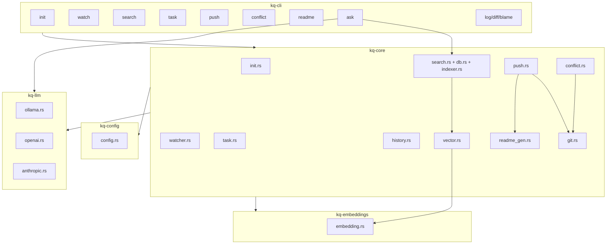

# Design Document: kq — Git-native Knowledge Platform

> **Status:** Draft  
> **Spec:** `kq-knowledge-platform`  
> **Language:** ru

## Overview

kq — CLI-инструмент на Rust для управления знаниями и документацией в Git + markdown. Единый бинарник без сервера и Web UI. Пользователи: разработчики (CLI), не-разработчики (Obsidian), tech leads (task + README).

**Impact:** Расширяет существующий код на 8 новых команд (push, conflict, readme, embeddings, ask, log/diff/blame и polish существующих). Существующее ядро (init, watcher, FTS, task CRUD, history) — стабильно и покрыто тестами.

### Goals
- Реализовать `kq push` с pull → rebase → README-gen → push
- Реализовать `kq conflict` для разрешения Git-конфликтов
- Реализовать README-генератор с Kanban-доской
- Реализовать векторный поиск (sqlite-vec + Candle)
- Реализовать `kq ask` с LLM-провайдерами
- CLI polish: справка, цветной вывод,
- Сохранить offline-first, single binary, zero external services

### Non-Goals
- Web UI / REST API (Obsidian — UI)
- Obsidian-плагин (опционально в будущем)
- Real-time коллаборация
- Гранулярные права доступа

## Boundary Commitments

### This Spec Owns
- Инфраструктура Git-синхронизации (push, pull, conflict resolution)
- README-генератор с Kanban-доской
- Векторный поиск (sqlite-vec + Candle)
- LLM-интеграция (trait + HTTP-провайдеры)
- CLI-интерфейс всех команд (справка, цветной вывод, error handling)
- Файловая структура `.kq/` (config, db, cache)

### Out of Boundary
- Сторонние LLM-провайдеры не часть kq — только конфигурация
- Модель эмбеддингов (all-MiniLM-L6-v2) не вшита в бинарник — скачивается при первом использовании
- Внешний Git remote (GitHub/GitLab) — ответственность пользователя

### Allowed Dependencies
- Уже в workspace: `git2`, `notify`, `rusqlite`, `clap`, `serde`, `toml`, `tokio`, `reqwest`, `sha2`, `serde_yaml`
- Новые: `candle` (уже в Cargo.toml), `sqlite-vec` (уже), `hf-hub` (уже), `syntect` (подсветка вывода)

## Architecture

### Existing Architecture

```
kq-cli (bin) ──> kq-core (lib) ──> kq-embeddings (lib, placeholder)
                    │                  kq-llm (lib, placeholder)
                    └──> kq-config (lib)
```

- **kq-cli:** Clap-команды, парсинг аргументов, цветной вывод
- **kq-core:** Вся бизнес-логика (init, db, indexer, search, git, watcher, task, history)
- **kq-config:** Парсинг `.kq/knowledge.toml`, настройки путей
- **kq-embeddings:** Сейчас пустой — будет реализован (Candle + all-MiniLM-L6-v2)
- **kq-llm:** Только trait `LlmProvider` — будут имплементации (Ollama, OpenAI, Anthropic)

### Architecture Changes



### Technology Stack

| Layer | Choice | Role | Notes |
|-------|--------|------|-------|
| CLI | clap 4 + clap_complete | Парсинг аргументов, автодополнение | Существующий |
| Search FTS | rusqlite FTS5 | Полнотекстовый поиск | Существующий |
| Vector Search | sqlite-vec | Векторная БД в SQLite | Добавить |
| Embeddings | candle + hf-hub | CPU inference, all-MiniLM-L6-v2 | Существующий (плейсхолдер) |
| LLM | reqwest (async) | HTTP к Ollama/OpenAI/Anthropic | Существующий (плейсхолдер) |
| Git | git2 | Git-операции | Существующий |
| Watcher | notify | Файловый watcher | Существующий |
| Async | tokio | Async runtime | Существующий |
| Config | serde + toml | Парсинг `.kq/knowledge.toml` | Существующий |
| Syntax highlight | syntect | Подсветка вывода в терминал | Новый |

## Структура проекта

```
<project>/
├── .kq/
│   ├── knowledge.toml      # конфиг kq
│   ├── db.sqlite           # FTS + векторная БД
│   ├── state.db            # SQLite — актуальное состояние
│   ├── events/             # CRDT-события
│   │   └── TASK-NNN/
│   │       └── YYYYMMDDTHHMMSSZ-<op>-<value>.md
│   ├── model-cache/        # кеш модели эмбеддингов
│   └── templates/          # шаблоны документов
├── users/                  # пользователи
├── docs/                   # документация
├── tasks/                  # задачи (TASK-NNN.md)
├── TypeSpec/               # TypeSpec-модели
├── knowledge.toml
└── README.md               # Kanban между <!-- kq:start -->
```

### Формат задачи

```markdown
---
title: "Implement auth"
priority: P2
created: 2026-07-09
updated: 2026-07-09
assign: alex
status: in_progress
---

# TASK-001: Implement auth

@alex status:in_progress
```

Фронтматер обновляется из CRDT-ивентов. `assign`, `status`, `updated` — не хранятся, а вычисляются.
Body содержит `@user` и `status:` для traceability.

### Watcher — pipeline обновлений

Ватчер отслеживает изменения в `.kq/events/` и `tasks/`. При детекте изменений:

1. **Debounce** (по умолчанию 600с, конфигурируемо)
2. **Events → Task**: для каждой директории в `.kq/events/TASK-NNN/` вызвать `update_task_refs()` — переписать frontmatter задачи из ивентов
3. **Task → README**: `readme_gen::generate(dir)` — обновить Kanban между `<!-- kq:start -->`
4. **Commit**: `git add .` + `git commit` — коммит всех изменений (events, tasks, README)
5. **Reindex**: `indexer::index_all(dir)` — переиндексация FTS

Содержимое вне `<!-- kq:start -->` в README не трогается.

#### Игнорируемые пути
```rust
const DEFAULT_IGNORE_DIRS: &[&str] = &[
    ".git", ".obsidian", "node_modules", "target",
    "db.sqlite", "state.db", "model-cache"
];
```
`.kq/events/` и `.kq/templates/` НЕ игнорируются.
**Dependencies:**
- Outbound: `git.rs` — open_repo(), auto_commit()
- Outbound: `readme_gen.rs` — generate()
- External: `git2` — remote, push, rebase

### kq-core/conflict.rs — Conflict Resolution

| Field | Detail |
|-------|--------|
| Intent | Обнаружение и разрешение Git-конфликтов |
| Requirements | 6.1–6.4 |

**Responsibilities:**
- `list()` — показать конфликтующие файлы (через `git2` index conflicts)
- `show(file)` — отобразить содержимое с маркерами `<<<<<<<` / `=======` / `>>>>>>>`
- `resolve(file, --ours/--theirs)` — программное разрешение

### kq-core/readme_gen.rs — README Generator

| Field | Detail |
|-------|--------|
| Intent | Генерация Kanban-доски между маркерами `<!-- kq:start -->` |
| Requirements | 8.1–8.5 |

**Responsibilities:**
- Парсинг README.md: найти/создать маркеры `<!-- kq:start -->` / `<!-- kq:end -->`
- Чтение всех задач из `tasks/` через `task.rs`
- Генерация: статистика, Kanban-доска (todo/in_progress/review/done), ссылки
- Запись только между маркерами, не трогать остальное

### kq-core/vector.rs — Vector Search

| Field | Detail |
|-------|--------|
| Intent | sqlite-vec интеграция + гибридный поиск |
| Requirements | 4.1–4.6 |

**Responsibilities:**
- Инициализация sqlite-vec в SQLite
- `store_embedding(file_id, vector)` — сохранение эмбеддинга
- `search_vector(query_vector, limit)` — поиск по косинусной близости
- `hybrid_search(query, fts_limit, vector_limit)` — взвешенное ранжирование (FTS + vector)

**Dependencies:**
- Outbound: `db.rs` — соединение с SQLite
- Outbound: `kq-embeddings::embedding` — генерация эмбеддингов

### kq-embeddings/embedding.rs — Embedding Model

| Field | Detail |
|-------|--------|
| Intent | Candle + all-MiniLM-L6-v2 inference |
| Requirements | 4.2–4.5 |

**Responsibilities:**
- `load_model()` — загрузка all-MiniLM-L6-v2 через hf-hub (кеш в `.kq/model-cache/`)
- `embed(text)` — токенизация + inference → Vec<f32> (384-dim)
- `embed_batch(texts)` — пакетная обработка
- Chunking: 512 токенов с перекрытием

**Contracts:**
```rust
pub struct EmbeddingModel { /* Candle model, tokenizer, config */ }
impl EmbeddingModel {
    pub fn load(cache_dir: &Path) -> Result<Self>;
    pub fn embed(&self, text: &str) -> Result<Vec<f32>>;
    pub fn embed_batch(&self, texts: &[&str]) -> Result<Vec<Vec<f32>>>;
}
```

### kq-llm/ — LLM Providers

| Field | Detail |
|-------|--------|
| Intent | HTTP-провайдеры для `kq ask` |
| Requirements | 11.1–11.5 |

**Trait (существующий):**
```rust
pub trait LlmProvider {
    fn name(&self) -> &str;
    fn ask(&self, prompt: &str, context: &[String]) -> Result<StreamableResponse>;
}
```

**Провайдеры:**
- `OllamaProvider` — `http://localhost:11434/api/generate`, streaming
- `OpenAiProvider` — `https://api.openai.com/v1/chat/completions`, streaming
- `AnthropicProvider` — `https://api.anthropic.com/v1/messages`, streaming

**Конфиг в `.kq/knowledge.toml`:**
```toml
[llm]
provider = "ollama"  # ollama | openai | anthropic
model = "llama3"
api_key = ""  # только для openai/anthropic
endpoint = ""  # кастомный endpoint (опционально)
```

### kq-core/docs.rs — Documentation Scaffolding

| Field | Detail |
|-------|--------|
| Intent | Управление шаблонами и генерация документов по стандарту |
| Requirements | 13.1–13.14 |

**Responsibilities:**
- `init_docs(path)` — создание структуры `docs/` по Grok-стандарту (9 категорий)
- `generate(template, title)` — создание документа из шаблона с авто-нумерацией
- `list()` — список всех документов, сгруппированных по категориям
- `templates_list()` — список доступных шаблонов
- Загрузка шаблонов из `.kq/templates/` (с фолбэком на встроенные)
- Авто-нумерация: сканирование существующих файлов, поиск макс NNN + 1
- Заполнение frontmatter (status: Draft, date, author из git config)

**Dependencies:**
- Inbound: `kq-config` — знание корня проекта
- External: `git2` — получение автора (user.name) для frontmatter

**Шаблоны (встроенные):**
Каждый шаблон в `.kq/templates/<type>.md`:
```markdown
---
type: adr
status: Draft
date: {{DATE}}
author: {{AUTHOR}}
---
# ADR-{{NUMBER}}: {{TITLE}}

## Контекст
...
## Решение
...
## Альтернативы
...
## Последствия
- Positive:
- Negative:
- Neutral:
```

Типы шаблонов: `bft`, `brd`, `frd`, `nfr`, `adr`, `rfc`, `tz`, `idea`, `user_story`, `glossary`, `screen`, `userflow`

### kq-core/typespec.rs — TypeSpec Management

| Field | Detail |
|-------|--------|
| Intent | Создание и парсинг .tsp-файлов, извлечение @doc-ссылок |
| Requirements | 14.1–14.5 |

**Responsibilities:**
- `new(name)` — создание `.tsp`-файла с моделью из шаблона
- `list()` — парсинг всех `.tsp`-файлов, извлечение имён моделей и `@doc`-комментариев
- `parse_model(file)` — извлечение model name, fields, decorators, @doc
- Генерация `main.tsp` с namespace и импортами
- Поддержка TypeSpec-синтаксиса: `model`, `enum`, `namespace`, `@doc()`, `@minLength()`, `@maxValue()`

**Dependencies:**
- External: `tsp` CLI (опционально, для компиляции в OpenAPI)

**Пример генерируемого файла:**
```tsp
// @doc TZ-017 — модель пользователя
// @doc SCR-003 — отображается на экране регистрации
model User {
  id: uuid;
  email: string;
  @minLength(1)
  name: string;
  role: UserRole;
  createdAt: utcDateTime;
}
```

### kq-core/check.rs — Traceability Check

| Field | Detail |
|-------|--------|
| Intent | Построение матрицы @doc-связей между .md и .tsp, поиск орфанов |
| Requirements | 16.1–16.6 |

**Responsibilities:**
- `traceability()` — сканирование всех .md и .tsp, сбор `@doc ID`, построение матрицы
- `orphans()` — поиск моделей в .tsp без обратных ссылок из документации
- `orphans_code()` — сканирование Rust-структур, поиск неописанных в .tsp
- `broken_links()` — `@doc` на несуществующий файл/модель
- Форматирование вывода: таблица (объект, тип, статус, ссылки, рекомендация)
- Exit code: 0 = полная связность, 1 = пробелы

**Алгоритм traceability:**
1. Сканировать `docs/**/*.md` → найти все `@doc XXX-NNN`
2. Сканировать `docs/**/*.tsp` → найти все `// @doc XXX-NNN`
3. Построить граф: узел = документ/модель, ребро = @doc
4. Проверить каждый узел на входящие/исходящие связи
5. Вывести:
   - Орфаны (модели без документации)
   - Голые ссылки (@doc на несуществующий файл)
   - Оборванные документы (без единого @doc)
   - Полные цепочки (документация ↔ модель ↔ код)

**Зависимости:**
- Inbound: `docs.rs` — enum типов документов
- Inbound: `typespec.rs` — список моделей
- External: `syn` (Rust) — парсинг Rust-структур для `orphans_code()`

| Req | Summary | Component | Key Detail |
|-----|---------|-----------|------------|
| 1 | kq init | `init.rs` | ✅ Существующий |
| 2 | Watcher | `watcher.rs` | ✅ Существующий |
| 3 | FTS Search | `search.rs` | ✅ Существующий |
| 4 | Vector Search | `vector.rs` + `embedding.rs` | Новый |
| 5 | Push | `push.rs` + `git.rs` | Новый |
| 6 | Conflict | `conflict.rs` | Новый |
| 7 | Task mgmt | `task.rs` | ✅ Существующий |
| 8 | README gen | `readme_gen.rs` | Новый |
| 9 | History | `history.rs` | ✅ Существующий |
| 10 | Multi-repo | `watcher.rs` | ✅ Существующий |
| 11 | LLM | `kq-llm/*` | Новый |
| 12 | CLI polish | `main.rs` | Модификация |
| 13 | Doc scaffolding | `docs.rs` + `.kq/templates/` | Новый |
| 14 | TypeSpec | `typespec.rs` | Новый |
| 15 | Screen/Userflow | `docs.rs` (screen шаблон) | Новый |
| 16 | Traceability check | `check.rs` | Новый |
## Data Model

### SQLite Schema (дополнение к существующему)

`.kq/db.sqlite`

**Существующие таблицы:**
- `files(id, path, content_hash, content)` + `files_fts` FTS5 virtual table

**Новые таблицы:**
```sql
-- Векторные эмбеддинги (sqlite-vec)
CREATE TABLE vec_embeddings (
    id INTEGER PRIMARY KEY,
    file_id INTEGER NOT NULL REFERENCES files(id),
    chunk_index INTEGER NOT NULL,
    chunk_text TEXT NOT NULL,
    embedding FLOAT[384] NOT NULL  -- sqlite-vec vector column
);

CREATE INDEX idx_vec_file ON vec_embeddings(file_id);
```

### File Structure

```
<project>/
├── .kq/
│   ├── knowledge.toml      # Конфиг (serde + toml)
│   ├── db.sqlite           # FTS5 + vec_embeddings
│   └── model-cache/        # all-MiniLM-L6-v2 кеш
├── docs/                   # Пользовательская документация
├── tasks/                  # TASK-NNN.md с frontmatter
└── README.md               # С маркерным блоком <!-- kq:start -->

~/.cache/kq/models/         # Системный кеш модели (опционально)
```

## Error Handling

### Error Categories

| Сценарий | Компонент | Поведение |
|----------|-----------|-----------|
| Git conflict при push | push.rs | exit 1, инструкция по `kq conflict` |
| LLM провайдер недоступен | kq-llm/* | Сообщение об ошибке, предложение проверить конфиг |
| Модель не скачана | embedding.rs | `kq search` — FTS работает, предупреждение |
| SQLite ошибка | db.rs + vector.rs | Паника только при невосстановимой ошибке |
| Network timeout | push.rs, kq-llm | Retry (push) / error message (ask) |

## Testing Strategy

### Unit Tests
- `push.rs`: dry-run флаг, README-gen вызов, pull failure
- `conflict.rs`: list/show/resolve — ours/theirs
- `readme_gen.rs`: парсинг маркеров, Kanban-генерация, без маркеров
- `vector.rs`: store/search, hybrid rank, пустая БД
- `embedding.rs`: загрузка модели, embed(), chunking (skip если нет сети)
- `kq-llm`: mock HTTP server для каждого провайдера

### Integration Tests
- `kq init && touch docs/test.md && kq search --fts "test"` — полный цикл
- `kq push` с временным remote (local bare repo)
- README: init → task new → readme → проверить Kanban-таблицу

## Architecture Decisions

| ID | Вопрос | Варианты | Статус |
|----|--------|----------|--------|
| D-001 | Где кеш модели? | `.kq/model-cache/` / `~/.cache/kq/` | Решено: `~/.cache/kq/` |
| D-002 | Streaming LLM? | `tokio::mpsc` / `futures::stream` | Решено: `tokio::mpsc` |
| D-003 | Где хранить статус задачи? | Frontmatter / CRDT-события / SQLite | Решено: **CRDT-события** |
| D-004 | Формат событий? | JSON / YAML frontmatter в .md | Решено: **YAML frontmatter (.md)** |
| D-005 | Как хранить пользователей? | В конфиге / отдельные .md в users/ / SQLite | Решено: **users/<username>.md** |
| D-006 | Сортировка событий? | По таймстемпу / по имени файла / Git-коммиту | Решено: **по имени файла (YYYYMMDDTHHMMSSZ)** |
| D-007 | LWW при конфликте assign? | Last-Writer-Wins / manual merge | Решено: **LWW по таймстемпу** |
| D-008 | Kanban формат в README? | Список / Таблица / HTML | Решено: **Markdown-таблица** |

### D-003: CRDT-события для статуса задач

**Проблема:** Хранение status/assignee в frontmatter `tasks/TASK-NNN.md` вызывает merge-конфликты
при параллельной работе нескольких участников.

**Решение:** Статус и ассигни вычисляются из событий в `.kq/events/TASK-NNN/`.
Каждое событие — отдельный `.md` файл с YAML frontmatter, который пишется один раз и
никогда не редактируется. Конфликтов нет — у каждого файла уникальное имя по таймстемпу.

**Структура:**
```
.kq/events/TASK-142/
├── 20260709T100000Z-create-todo.md
├── 20260709T110000Z-assign-alex.md
└── 20260709T120000Z-move-review.md
```

**Формат события:**
```markdown
---
task: TASK-142
op: assign
value: alex
timestamp: 2026-07-09T10:00:00Z
---

# TASK-142 — assign alex
```

**Порядок разрешения конфликтов:**
- Разные поля (assign + move) — независимы, merge без конфликта
- Одно поле (assign + assign) — LWW по таймстемпу в имени файла
- Одна секунда — LWW по алфавиту имени файла

### D-005: User management

**Структура:**
```markdown
---
username: alex
name: Alex Smith
created: 2026-07-09
role: member
---

# Alex Smith
```

**Команды:**
```bash
kq user create <username> [--name "Display Name"]
kq user list
kq user show <username>
```
