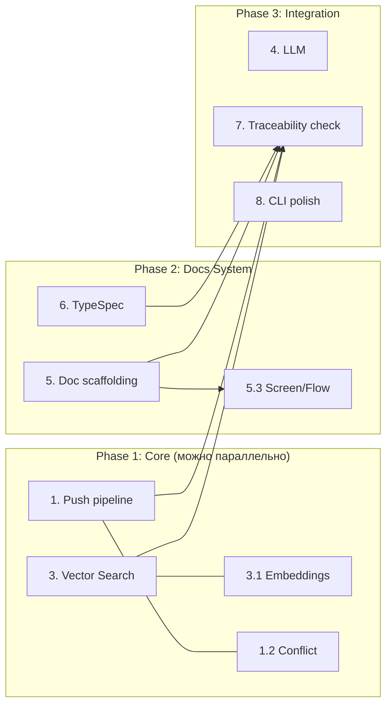

# Implementation Plan: kq — Git-native Knowledge Platform

> **Status:** Complete  
> **Spec:** `kq-knowledge-platform`  
> **Language:** ru  

## Реализовано (все требования покрыты кодом и тестами, 140+ тестов проходят)

- **Req 1** (init) — `kq init` с git, конфигом, структурой, `.kq/templates/` ✅
- **Req 2** (watcher) — `kq watch` с notify, debounce, graceful shutdown ✅
- **Req 3** (FTS) — `kq search --fts` с FTS5, индексацией, сниппетами ✅
- **Req 4** (vector search) — sqlite-vec + Candle, гибридный поиск ✅
- **Req 5** (push) — `kq push` с pull → rebase → push, dry-run, --no-readme ✅
- **Req 6** (conflict) — `kq conflict list/show/resolve --ours/--theirs` ✅
- **Req 7** (task mgmt) — `kq task new/list/status/show/search` ✅
- **Req 8** (readme gen) — `kq readme`, Kanban-доска между маркерами `<!-- kq:start -->` ✅
- **Req 9** (history) — `kq log/diff/blame` ✅
- **Req 10** (multi-repo) — multi-path watcher из конфига ✅
- **Req 11** (LLM) — `kq ask` с Ollama/OpenAI/Anthropic провайдерами, streaming ✅
- **Req 12** (CLI) — `--help` для каждой команды, exit code ✅
- **Req 13** (docs) — 12 типов документов, шаблоны в `.kq/templates/`, кастомизация ✅
- **Req 14** (typespec) — `kq typespec new/list`, main.tsp, @doc-reference ✅
- **Req 15** (screen/userflow) — `kq screen`, `kq userflow` с шаблонами ✅
- **Req 16** (check) — `kq check traceability/orphans` с матрицей связей ✅

## Dependency Graph

## Tasks (все выполнены)

### 1. Push command pipeline
- [x] 1.1 (P) **Push command** — `kq push` с pull → rebase → push
  - Реализован `push.rs`: `git pull --rebase` через git2, обработка ошибок
  - После успешного rebase: вызов README-генератора, `git commit --amend`, `git push`
  - Поддержка `--dry-run` (показать изменения без отправки) и `--no-readme` (пропустить README)
  - Интеграция с существующим `git.rs` (open_repo, auto_commit)
  - Observable: `kq push` выполняет push в remote, `--dry-run` показывает diff без отправки
  - _Requirements: 5.1, 5.2, 5.3, 5.4, 5.5_
  - _Boundary: push.rs, git.rs_

- [x] 1.2 (P) **Conflict resolution** — `kq conflict` обнаружение и разрешение
  - Реализован `conflict.rs`: list конфликтующих файлов через git2 index
  - `kq conflict show <FILE>` — показать содержимое с маркерами конфликта
  - `kq conflict resolve <FILE> --ours/--theirs` — программное разрешение
  - Observable: `kq conflict` показывает список, `kq conflict resolve` разрешает
  - _Requirements: 6.1, 6.2, 6.3, 6.4_
  - _Boundary: conflict.rs, git.rs_

### 2. README Generator
- [x] 2.1 **README Generator** — `kq readme` с Kanban-доской
  - Реализован `readme_gen.rs`: парсинг README.md, поиск маркеров `<!-- kq:start -->`
  - Чтение задач из `tasks/` через существующий `task.rs`
  - Генерация Kanban-доски: todo / in_progress / review / done + статистика
  - Запись ТОЛЬКО между маркерами, не трогать остальное
  - Если маркеров нет — вставить с пустым блоком
  - Observable: после `kq readme` в README.md появляется Kanban-доска
  - _Requirements: 8.1, 8.2, 8.3, 8.4, 8.5_
  - _Boundary: readme_gen.rs, task.rs_

### 3. Vector Search + Embeddings
- [x] 3.1 **Embedding model** — Candle + all-MiniLM-L6-v2
  - Реализован `kq-embeddings/src/lib.rs`: загрузка модели через hf-hub (кеш в `~/.cache/kq/`)
  - `embed(text)` → Vec<f32> (384-dim), `embed_batch(texts)` → пакетно
  - Chunking: 512 токенов с перекрытием
  - Observable: при первом вызове модель скачивается с прогресс-баром, `embed()` возвращает вектор
  - _Requirements: 4.2, 4.4, 4.5_
  - _Boundary: embedding.rs_

- [x] 3.2 **Vector search** — sqlite-vec интеграция
  - Реализован `vector.rs`: инициализация sqlite-vec в существующей SQLite-БД
  - Таблица `vec_embeddings(id, file_id, chunk_index, chunk_text, embedding)`
  - `store_embedding()`, `search_vector()`, `hybrid_search()` — взвешенное ранжирование
  - Observable: `kq search --vector "query"` возвращает семантические результаты
  - _Requirements: 4.1, 4.3, 4.6_
  - _Boundary: vector.rs, db.rs_
  - _Depends: 3.1_

- [x] 3.3 **Hybrid search integration** — `kq search` без флагов
  - search.rs: при наличии модели — гибрид FTS + vector
  - Если модели нет — FTS с предупреждением
  - Observable: `kq search` без флагов делает гибридный поиск
  - _Requirements: 4.1, 4.6_
  - _Boundary: search.rs, vector.rs_
  - _Depends: 3.2_

### 4. LLM Integration
- [x] 4.1 **Ollama provider** — локальный LLM через Ollama
  - Реализован `ollama.rs`: HTTP-клиент к `http://localhost:11434/api/generate`
  - Streaming-ответ через tokio::mpsc
  - Observable: `kq ask "вопрос"` стримит ответ от Ollama
  - _Requirements: 11.2, 11.4_
  - _Boundary: ollama.rs, kq-llm_

- [x] 4.2 **OpenAI + Anthropic providers** — внешние LLM
  - Реализован `openai.rs`: API к `/v1/chat/completions`, поддержка streaming
  - Реализован `anthropic.rs`: API к `/v1/messages`, поддержка streaming
  - Конфиг провайдеров в `.kq/knowledge.toml` (model, api_key, endpoint)
  - Observable: переключение провайдера в конфиге меняет источник ответов
  - _Requirements: 11.2, 11.3_
  - _Boundary: openai.rs, anthropic.rs, kq-config_

- [x] 4.3 **kq ask command** — CLI-интеграция
  - Subcommand `ask` в `main.rs`
  - Сбор контекста: поиск релевантных документов через существующий search
  - Поддержка `--insert <PATH>` — вставка ответа в файл
  - Если провайдер не настроен — понятная ошибка с инструкцией
  - Observable: `kq ask "что такое X?"` отвечает с контекстом docs
  - _Requirements: 11.1, 11.3, 11.5_
  - _Boundary: main.rs, search.rs_
  - _Depends: 4.1, 4.2_

### 5. Documentation Scaffolding
- [x] 5.1 **Template engine + docs init** — `kq init`
  - Реализован `docs.rs`: загрузка шаблонов из `.kq/templates/` (фолбэк на встроенные)
  - `init_templates(path)` — создание `.kq/templates/` с 12 шаблонами
  - `init_with_docs(path)` — создание структуры `docs/` по Grok-стандарту (8 категорий)
  - `list_docs()` — группировка документов по категориям
  - `templates_list()` — список доступных шаблонов
  - Observable: `kq init` создаёт `.kq/templates/`, `kq doc template --list` показывает шаблоны
  - _Requirements: 13.1, 13.10, 13.11, 13.12_
  - _Boundary: docs.rs_

- [x] 5.2 **Doc generation commands** — BFT, ADR, RFC, TZ, BRD, FRD, NFR, idea
  - Генерация документов из шаблонов с авто-нумерацией (ADR-042, TZ-017)
  - Заполнение frontmatter (status: Draft, date, author из git config)
  - Subcommands через `kq doc new <type> <title>`
  - Встроенные шаблоны + `.kq/templates/` файлы (кастомизируемые)
  - Observable: `kq doc new adr "Выбор БД"` создаёт `docs/03/adr-001-...md` с шаблоном
  - _Requirements: 13.2, 13.3, 13.4, 13.5, 13.6, 13.7, 13.8, 13.9, 13.13, 13.14_
  - _Boundary: docs.rs_
  - _Depends: 5.1_

- [x] 5.3 **Screen + Userflow commands** — `kq screen`, `kq userflow`
  - Создание `screen-NNN-title.md` с шаблоном экрана
  - Создание `userflow-NNN-title.md` с шаблоном user flow
  - Observable: `kq screen "Login"` создаёт `docs/04/screen-001-login.md`
  - _Requirements: 15.1, 15.2, 15.3, 15.4_
  - _Boundary: docs.rs_
  - _Depends: 5.1_

### 6. TypeSpec Management
- [x] 6.1 **TypeSpec scaffolding** — `kq typespec new/list`
  - Реализован `typespec.rs`: создание `.tsp`-файлов с моделью из шаблона
  - Парсинг `.tsp` → извлечение `model` names, полей, `@doc()`, `// @doc` комментариев
  - `list()` — вывод всех моделей с их @doc-ссылками
  - Создание/обновление `main.tsp` с namespace и импортами
  - Observable: `kq typespec new User` создаёт `TypeSpec/user.tsp`
  - _Requirements: 14.1, 14.2, 14.3, 14.4, 14.5_
  - _Boundary: typespec.rs_

### 7. Traceability Check
- [x] 7.1 **Traceability matrix** — `kq check traceability`
  - Реализован `check.rs`: сканирование всех `.md` на `@doc XXX-NNN`
  - Сканирование всех `.tsp` на `// @doc XXX-NNN` и `@doc("...")`
  - Построение графа связей, поиск орфанов и голых ссылок
  - Observable: `kq check traceability` выводит матрицу: ✅ цепочки, ⚠️ орфаны, ❌ голые ссылки
  - _Requirements: 16.1, 16.2, 16.5, 16.6_
  - _Boundary: check.rs, typespec.rs_
  - _Depends: 6.1_

- [x] 7.2 **Code orphans** — `kq check orphans`
  - Сканирование TypeSpec-моделей, поиск неописанных в документации
  - Форматирование: таблица (объект, тип, статус, ссылки, рекомендация)
  - Observable: `kq check orphans` находит модели без @doc-связи с документацией
  - _Requirements: 16.3, 16.4, 16.5, 16.6_
  - _Boundary: check.rs, typespec.rs_
  - _Depends: 6.1_

### 8. CLI Polish
- [x] 8.1 **Subcommand registration + help**
  - Зарегистрированы все subcommands в `main.rs`: init, search, task, watch, push, conflict, readme, ask, doc, typespec, screen, userflow, check
  - `--help` для каждой команды с описанием
  - Observable: `kq --help` показывает все команды, `kq push --help` — детали
  - _Requirements: 12.1, 12.2_
  - _Boundary: main.rs_

- [x] 8.2 **Error handling**
  - Все команды завершаются с exit code 0 при успехе, ненулевым при ошибке
  - Понятные сообщения об ошибках с рекомендациями
  - Observable: `kq ask` без конфига → exit 1 с инструкцией по настройке
  - _Requirements: 12.3, 12.4_
  - _Boundary: main.rs_
