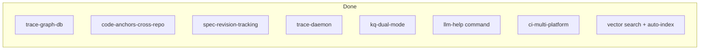

# Roadmap

## Specs

| ID | Name | Status |
|---|---|---|
| `trace-graph-db` | Trace Graph DB & Deep Coverage | ✅ |
| `code-anchors-cross-repo` | Code Anchors, Cross-Repos, Bidirectional monitor | ✅ |
| `spec-revision-tracking` | Spec Revision Tracking | ✅ |
| `trace-daemon` | Trace Daemon Mode | ✅ |
| `kq-dual-mode` | Dev Context & Doc Context | ✅ |
| `ci-multi-platform` | CI Multi-Platform Build & Release | ✅ |
| `kq-llm-help` | LLM-oriented help system | ✅ |
| `kq-search-improvements` | FTS auto-index + vector search + embeddings auto-update | ✅ |

All specs complete.
