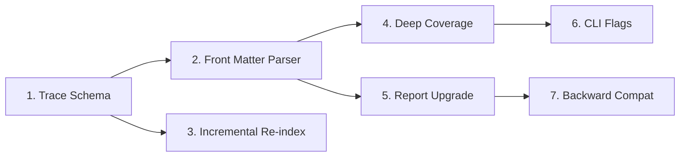

# Implementation Tasks: Trace Graph Database & Deep Coverage

> **Spec:** `trace-graph-db`
> **Language:** ru
> **Status:** Draft

## Dependency Graph



## Tasks

### 1. Trace Schema (db.rs)

**Effort:** M  
**Req:** REQ-001  
**Files:** `kq-core/src/db.rs`

Add SQLite tables `trace_nodes`, `trace_links`, `schema_version` to `create_schema()`.

**Acceptance:**
- `init_db()` creates trace tables
- `schema_version` stores version + last_indexed_commit
- Indexes on source_id, target_id, node_type exist
- `get_db()` works as before (backward compat)

**Implementation details:**
```rust
pub fn create_trace_schema(conn: &Connection) -> Result<()>;
pub fn get_last_indexed_commit(conn: &Connection) -> Result<Option<String>>;
pub fn set_last_indexed_commit(conn: &Connection, commit: &str) -> Result<()>;
```

### 2. Front Matter Parser (docs.rs + check.rs)

**Effort:** L  
**Req:** REQ-002  
**Files:** `kq-core/src/docs.rs`, `kq-core/src/check.rs`

Add `DocNode` struct, `DocType` enum, `detect_doc_type()`, `parse_doc_node()`, `parse_front_matter()`.

**Acceptance:**
- `detect_doc_type("bft-001-title.md")` → `Some(DocType::Bft)`
- `parse_doc_node()` extracts: id, title, status, type, revision, needs, covers, bft_refs, rfc_refs, code_anchors
- Inline `@doc XXX-NNN` still parsed from body
- `DocNode` serializable for --json output

### 3. Incremental Re-index (check.rs)

**Effort:** M  
**Req:** REQ-005  
**Files:** `kq-core/src/check.rs`

`rebuild_trace_graph()` — diff-based incremental update using git2.

**Acceptance:**
- Stores last_indexed_commit in schema_version
- On re-run: compares HEAD, skips if same
- On change: `git diff --name-only` → reindex only changed/added/deleted files
- Deleted files: node→removed, links cleaned
- Full rebuild if no last_indexed_commit

### 4. Deep Coverage Algorithm (check.rs)

**Effort:** L  
**Req:** REQ-003  
**Files:** `kq-core/src/check.rs`

SQL-based graph traversal for chain validation.

**Acceptance:**
- Default chain: `bft → (brd|frd|nfr) → adr → tz → typespec`
- `compute_deep_coverage()` returns per-node chain status
- Detects broken link position (e.g., BROKEN_at_ADR_to_TZ)
- Computes coverage %
- Terminating types: typespec, idea, glossary
- Configurable --chain flag support

### 5. Report Upgrade (check.rs)

**Effort:** M  
**Req:** REQ-004  
**Files:** `kq-core/src/check.rs`

Extended statuses, grouping, JSON output.

**Acceptance:**
- Statuses: covered, partial, orphan, dangling, stale
- Grouped by doc type with subtotals
- Stale links show: what changed, which links affected, timestamp
- `--json` flag: full graph in JSON
- JSON format compatible with editor plugins

### 6. CLI Flags (main.rs)

**Effort:** S  
**Req:** REQ-003, REQ-004  
**Files:** `kq-cli/src/main.rs`

Add `--deep`, `--chain`, `--json` to `kq check`.

**Acceptance:**
- `kq check traceability --deep` — deep coverage
- `kq check traceability --chain "bft adr tz"` — custom chain
- `kq check traceability --json` — JSON output
- Help text for all flags

### 7. Backward Compatibility (check.rs + db.rs)

**Effort:** S  
**Req:** REQ-006  
**Files:** `kq-core/src/check.rs`, `kq-core/src/db.rs`

Auto-migration for existing knowledge.db.

**Acceptance:**
- Missing trace tables auto-created on first kq check
- `kq check traceability` works without any new flags (default = old format)
- `kq check orphans` unchanged
- After deleting knowledge.db, `kq check` rebuilds everything
- All existing tests pass without modification
